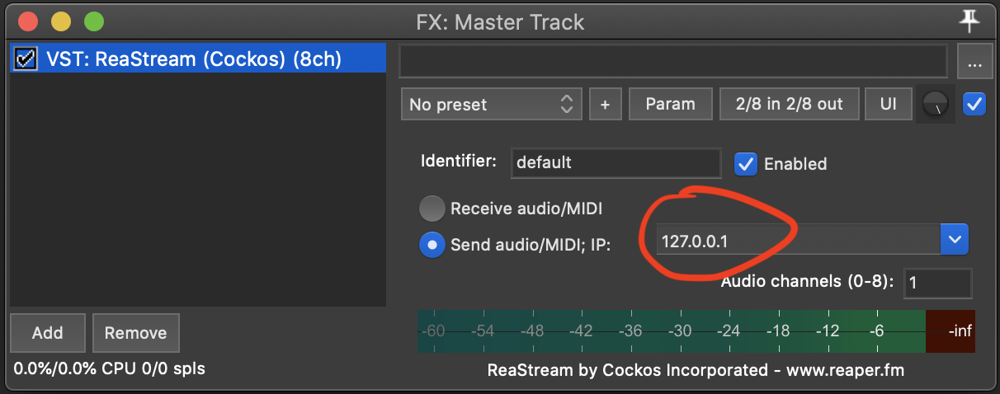

# reascript-discord-bot

A bot that can receive Reastream VST output (UDP packets) and stream it into a Discord voice channel. This way you can stream your favourite guitar plugin chain or even work on DAW projects together while streaming the master track of your DAW directly into Discord for all to hear.

[Get the latest version here](https://github.com/AxxlForce/reastream-discord-bot/releases)

**This is a very early development stage. Prepare to encounter numerous bugs and feel free to contribute by creating issues etc.**

## Configuration 

### Bot (bot_config.json)

The bot requires a JSON file with basic configuration (`bot_config.json`).  It won't start without it and requires the bot token and channel to join. The content of `bot_config.json` might look like this:

```
{
  "token": "Nzk3MjI3PjY5OTYwNDk5MjEw.X_jZwA.Iq12gJGCopinbHmtHnrm9t61GTY",
  "channel": "My Voice Channel"
}
```

 - #### `token: string`
    - Discord bot token (you can create/get your bot token here: https://discord.com/developers)
 - #### `channel: string`
    - the voice channel to join
 - #### `receiving_address: string`
    - address from which reastream UDP packets are received
    - default: `127.0.0.1`
- #### `port: number`
    - port from which reastream UDP packets are received
        - default: `58710`

### DAW

In your DAW load the Reastream VST and configure it to send audio to the bot (Reastream comes with Reaper or can be downloaded for other DAWs [here](https://www.reaper.fm/reaplugs/))



## Build

After cloning the repository run `sh build.sh`. Windows not supported for development atm.
